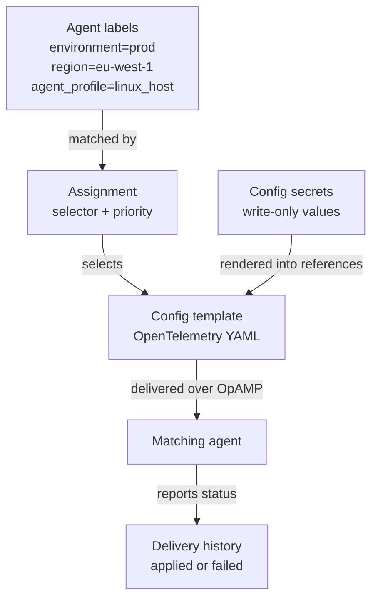

# Configure Agents

Fleet Management delivers OpenTelemetry Collector configuration to enrolled agents through config templates and label-based assignments.

---

## Config targeting model



Labels decide which agents receive a template. Delivery history shows whether the selected config was accepted by each agent.

---

## How config delivery works

A config template is a named YAML document managed in the xScaler portal. An assignment selects the agents that should receive that template.

When an agent checks in, xScaler evaluates enabled assignments against the agent labels. Matching templates are offered to the agent.

Important behavior:

- An empty selector matches every agent.
- `matchLabels` entries are combined with AND logic.
- `matchExpressions` support `In`, `NotIn`, `Exists`, and `DoesNotExist`.
- Multiple assignments can match the same agent.
- Priority resolves conflicts when matching assignments target the same template name.
- Template edits create new revisions.
- Rollbacks create a new current revision from a previous revision.

---

## Create a config template

1. Go to **Fleet Management -> Config**.
2. Open **Config templates & assignments**.
3. Click **New template**.
4. Enter a name, description, and YAML body.
5. Click **Create**.

Example template body:

```yaml
receivers:
  hostmetrics:
    collection_interval: 15s
    scrapers:
      cpu: {}
      memory: {}
      filesystem: {}
      network: {}

processors:
  batch: {}

exporters:
  otlphttp/xscaler:
    endpoint: https://euw1-01.m.xscalerlabs.com
    headers:
      Authorization: "Bearer ${secret:XSCALER_OTLP_TOKEN}"
      X-Scope-OrgID: "<tenant-id>"

service:
  pipelines:
    metrics:
      receivers: [hostmetrics]
      processors: [batch]
      exporters: [otlphttp/xscaler]
```

Use [config secrets](/fleet-management/secrets) for tokens and sensitive values.

---

## Assign a template

1. Go to **Fleet Management -> Config -> Config templates & assignments**.
2. Click **New assignment**.
3. Select the template.
4. Choose labels with the builder, or switch to JSON mode.
5. Set priority.
6. Keep the assignment enabled.
7. Confirm the match count.
8. Save the assignment.

The match count shows how many agents currently match the selector. Use it before saving broad changes.

---

## Selector examples

All production Linux hosts:

```json
{
  "matchLabels": {
    "environment": "prod",
    "agent_profile": "linux_host"
  }
}
```

Hosts in selected regions:

```json
{
  "matchExpressions": [
    {
      "key": "region",
      "operator": "In",
      "values": ["eu-west-1", "us-east-1"]
    }
  ]
}
```

All agents except canary:

```json
{
  "matchExpressions": [
    {
      "key": "tier",
      "operator": "NotIn",
      "values": ["canary"]
    }
  ]
}
```

Agents with an owner label:

```json
{
  "matchExpressions": [
    {
      "key": "team",
      "operator": "Exists"
    }
  ]
}
```

---

## Review revisions and roll back

Open a template to view:

- Current revision.
- Config hash.
- Description.
- YAML body.
- Revision history.
- Change notes.

To roll back:

1. Open the template.
2. Find a previous revision in **Revision history**.
3. Click **Roll back to this**.

Rollback makes a new current revision using the selected previous body. Agents matching enabled assignments receive the updated config on their next check-in.

---

## Confirm delivery

Open **Fleet Management -> Agents**, then select an agent.

Check:

- **Config hash** for the latest config known by the agent.
- **Effective config** for the rendered config body reported by the agent.
- **Config delivery history** for rollout status.

Delivery statuses:

| Status | Meaning |
|--------|---------|
| `offered` | xScaler offered config to the agent. |
| `applying` | The agent reported that it is applying config. |
| `applied` | The agent reported that config was applied. |
| `failed` | The agent rejected or failed to apply the config. |

If delivery fails, check the error text in delivery history and see [Troubleshooting](/fleet-management/troubleshooting).

---

## Safe rollout checklist

1. Start with labels that match a small subset of agents.
2. Confirm the assignment match count.
3. Save the assignment.
4. Watch delivery status on agent detail pages.
5. Expand the selector after the config is applied successfully.
6. Add a change note when saving template revisions.
