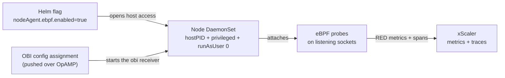

# eBPF Instrumentation (OBI)

OpenTelemetry eBPF Instrumentation (OBI) instruments your applications from the Linux kernel — no code changes, no SDKs, and no pod restarts. It watches network sockets and emits **RED metrics** (request **R**ate, **E**rrors, **D**uration) plus server and client spans for the traffic it observes.

This is an **opt-in** layer of the xscaler-agent Helm chart. The base agent (metrics and logs) is covered in [Enroll Agents](/fleet-management/enroll-agents) and [Configure Agents](/fleet-management/configure-agents). This page assumes the base agent is already installed and enrolled.

:::note Versions may drift
Chart, image, and OBI receiver configuration keys evolve over time. Pin the values below to a known-good release and treat the OBI receiver config as **version-specific** — a key that works on one chart version can change or move on the next. Check the release notes for your `<chart-version>` before copying config forward.
:::

---

## eBPF vs. Operator auto-instrumentation

Two zero-code methods are available. They are complementary — you can run both.

| | **eBPF (OBI)** — this page | **Operator auto-instrumentation** — [see traces page](/fleet-management/traces-auto-instrumentation) |
|---|---|---|
| How it works | Kernel eBPF probes on network sockets | Language SDK injected into the pod at admission |
| Signal | RED metrics + server/client spans | Rich language-level distributed traces |
| App changes | None | Pod annotation only |
| Restart required | No | Yes (pod is recreated with an init container) |
| Language support | Language-agnostic | java, python, nodejs, dotnet, go |
| Privileges | Node DaemonSet needs host access + root | Standard workload permissions |
| Best for | Broad, low-effort coverage across services | Deep spans for specific applications |

---

## How it fits together



Enabling eBPF takes **two independent steps**:

1. **The Helm flag** grants the node DaemonSet the host access OBI needs. It does **not** start collecting anything on its own.
2. **A pushed OBI config assignment** adds the `obi` receiver and its pipelines. Collection starts only after this config is delivered.

:::warning The Helm flag alone collects nothing
The `obi` receiver and its pipelines are **not** part of the chart. They arrive as an OpAMP config assignment targeting the node DaemonSet (see [Configure Agents](/fleet-management/configure-agents)). Until that config is assigned, the DaemonSet has host access but produces no eBPF telemetry — while metrics and logs keep flowing normally. This is expected, not a broken pipeline.
:::

---

## Step 1 — Enable eBPF host access (Helm)

Add these values to the base install (or `helm upgrade` an existing release):

```bash
helm upgrade <cluster> oci://ghcr.io/xscaler/charts/xscaler-agent \
  --version <chart-version> \
  --namespace xscaler --reuse-values \
  --set nodeAgent.ebpf.enabled=true \
  --set nodeAgent.ebpf.clusterName='<cluster>'
```

Setting `nodeAgent.ebpf.enabled=true` reconfigures the node DaemonSet with **all three** of the following. OBI cannot attach its probes unless every one is present:

| Setting | Value | Why |
|---------|-------|-----|
| `hostPID` | `true` | OBI must see host processes to attach to them. |
| Security context | `privileged` | Required to load eBPF programs into the kernel. |
| `runAsUser` | `0` (root) | eBPF probe attachment requires root. |

:::warning Architecture and image
eBPF instrumentation is supported on **amd64** and **arm64** nodes only. The chart automatically selects the OBI-enabled agent image when `nodeAgent.ebpf.enabled=true` — you do not set an image tag manually.
:::

Verify the DaemonSet rolled out with host access:

```bash
kubectl -n xscaler get pods -l role=node
kubectl -n xscaler get daemonset -l role=node \
  -o jsonpath='{.items[0].spec.template.spec.hostPID}{"\n"}'
# expect: true
```

---

## Step 2 — Assign the OBI receiver config

Push a config template to the node DaemonSet that adds the `obi` receiver and wires it into pipelines. Create it as a config template and assign it to `role=node` agents — see [Configure Agents](/fleet-management/configure-agents) for the portal workflow.

```yaml
receivers:
  obi:
    # Discovery: WHAT to instrument. See "Discovery" below — this is the
    # single most important block to get right.
    discovery:
      instrument:
        - open_ports: "80,443,3000,5000,8000,8080,8443,9090"
    attributes:
      kubernetes:
        # QUOTED string, not a YAML boolean. "true" (with quotes), never true.
        enable: "true"

processors:
  batch: {}

exporters:
  otlphttp/xscaler-metrics:
    endpoint: https://euw1-01.m.xscalerlabs.com
    headers:
      Authorization: "Bearer ${secret:XSCALER_OTLP_TOKEN}"
      X-Scope-OrgID: "<tenant-id>"
  otlphttp/xscaler-traces:
    endpoint: https://euw1-01.t.xscalerlabs.com
    headers:
      Authorization: "Bearer ${secret:XSCALER_OTLP_TOKEN}"
      X-Scope-OrgID: "<tenant-id>"

service:
  pipelines:
    metrics/obi:
      receivers: [obi]
      processors: [batch]
      exporters: [otlphttp/xscaler-metrics]
    traces/obi:
      receivers: [obi]
      processors: [batch]
      exporters: [otlphttp/xscaler-traces]
```

Use [config secrets](/fleet-management/secrets) for the ingest token (`${secret:XSCALER_OTLP_TOKEN}`) rather than pasting it into the template.

:::danger Do not add a metrics `features` block to the `obi` receiver
Application RED metrics are **on by default**. Do **not** add a `features:` list (or similar metrics-selection block) under the `obi` receiver to "turn them on." Its value type does not decode through the Collector config loader and will **crash the Collector on startup**. Leave RED metrics to their default and omit the block entirely.
:::

---

## Discovery: the #1 thing to get right

Discovery decides **which processes OBI instruments**. Getting this wrong is the most common failure — and it looks exactly like a broken pipeline even though nothing is broken.

### Use `open_ports`

Select workloads by their **listening port**. OBI reads the listening socket directly from the kernel, so this match is reliable and has **no dependency on Kubernetes metadata**.

```yaml
discovery:
  instrument:
    - open_ports: "80,443,3000,5000,8000,8080,8443,9090"
```

### Do not select by `k8s_namespace` / `k8s_pod_label`

```yaml
# AVOID — depends on the Kubernetes metadata informer
discovery:
  instrument:
    - k8s_namespace: "."        # even "all namespaces" does not save you
      k8s_pod_labels:
        app: my-service
```

Kubernetes selectors resolve through OBI's **Kubernetes metadata informer**, which needs RBAC to list and watch pods, and which races pod-metadata resolution at discovery time. When it loses that race, OBI discovers and instruments **nothing** — while metrics and logs continue to flow normally. The result reads as a broken eBPF pipeline but is really just discovery selecting zero targets. Setting `k8s_namespace: "."` (all namespaces) does **not** avoid the race. Match on `open_ports` instead.

:::tip Scope ports to your application ports
A wide `open_ports` range across every namespace also instruments infrastructure (ingress, sidecars, system services) and can **overwhelm ingest and inflate cost**. List only the ports your applications actually listen on. Start narrow and widen deliberately.
:::

---

## Step 3 — Verify

1. Confirm the config was applied on the node agents in **Fleet Management → Agents** (config hash and delivery status `applied`). See [Configure Agents](/fleet-management/configure-agents#confirm-delivery).
2. Generate some traffic to an instrumented workload.
3. Query the RED metrics in xScaler.

RED metric names in this backend carry **no `_seconds` unit suffix**. The duration histogram is exposed as:

```
http_server_request_duration_count
http_server_request_duration_sum
http_server_request_duration_bucket
```

Example PromQL:

```promql
# Request rate per service (requests/sec)
sum(rate(http_server_request_duration_count[5m])) by (service_name)

# Error ratio (5xx responses / all responses)
sum(rate(http_server_request_duration_count{http_response_status_code=~"5.."}[5m])) by (service_name)
/
sum(rate(http_server_request_duration_count[5m])) by (service_name)

# p95 latency (seconds)
histogram_quantile(
  0.95,
  sum(rate(http_server_request_duration_bucket[5m])) by (le, service_name)
)
```

You should also see server/client spans for the same traffic in the [Traces](/trace-query/overview) view.

---

## Kubernetes labels (`k8s.*`) and RBAC

Attributes like `k8s_namespace_name` and `k8s_pod_name` on OBI metrics and spans come from OBI's **Kubernetes metadata informer** (enabled by `attributes.kubernetes.enable: "true"`). The informer needs RBAC to read cluster metadata:

```yaml
# ClusterRole rules the node agent's ServiceAccount needs for k8s.* labels
- apiGroups: [""]
  resources: ["pods", "services", "nodes"]
  verbs: ["get", "list", "watch"]
- apiGroups: ["apps"]
  resources: ["replicasets"]
  verbs: ["get", "list", "watch"]
```

The chart provisions this RBAC when eBPF is enabled. If telemetry arrives but the `k8s_namespace_name` / `k8s_pod_name` labels are **missing**, the fix is almost always this RBAC — confirm the node agent's ServiceAccount is bound to a ClusterRole with `get`/`list`/`watch` on pods, replicasets, services, and nodes.

:::note Discovery vs. enrichment
`open_ports` decides **whether** a process is instrumented (kernel-only, no RBAC). The `k8s.*` labels only **enrich** telemetry that OBI already produces. Missing RBAC removes the labels; it does not stop collection. That is why you select targets with `open_ports`, not with `k8s_*`.
:::

---

## Troubleshooting

### Metrics and logs flow, but no eBPF telemetry

This is the signature symptom. eBPF collection is a separate path from base metrics/logs, so the base pipeline looking healthy tells you nothing about OBI. Work through these in order:

1. **Is an OBI config actually assigned?** The Helm flag only opens host access. Confirm a config template with the `obi` receiver is delivered and `applied` to `role=node` agents (**Fleet Management → Agents**).
2. **Is discovery matching anything?** This is the most likely cause. Switch any `k8s_namespace` / `k8s_pod_label` selectors to `open_ports`, and confirm your workloads actually listen on the listed ports.
3. **Did the Collector crash on start?** Check the node agent pod logs. A crash loop right after config delivery usually means an invalid `obi` receiver key — most often a `features` block that does not decode (see the warning in Step 2).
4. **Is host access really granted?** Verify `hostPID: true`, `privileged`, and `runAsUser: 0` on the DaemonSet pod spec. Missing any one prevents probe attachment.
5. **Is the node architecture supported?** OBI runs on amd64/arm64 only.

### Telemetry arrives but `k8s.*` labels are missing

The Kubernetes metadata informer lacks RBAC. See [Kubernetes labels and RBAC](#kubernetes-labels-k8s-and-rbac) above.

### Ingest spikes or unexpected cost after enabling

A broad `open_ports` range instrumented infrastructure and system workloads too. Narrow the port list to your application ports and re-assign the config.

### Collector crash loop immediately after config delivery

An `obi` receiver key failed to decode. Remove any metrics `features` block, revert to the [Step 2](#step-2--assign-the-obi-receiver-config) template, and re-assign. Remember the OBI config is version-specific — a key valid on another chart version may not decode on yours.
