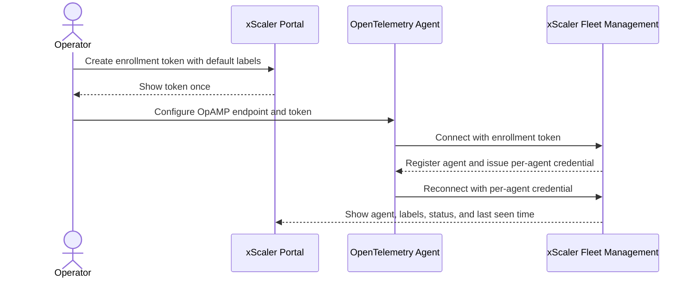

# Enroll Agents

Enrollment connects OpenTelemetry agents and collectors to xScaler Fleet Management. After enrollment, the agent appears in the fleet inventory and can receive config from xScaler.

---

## Enrollment flow



The enrollment token is only used for bootstrap. After enrollment, the agent uses its own credential for reconnects.

---

## Before you begin

You need:

- Admin or owner access to the xScaler portal.
- Outbound network access from the agent host to `wss://agents.xscalerlabs.com/v1/opamp`.
- An OpenTelemetry Collector setup that can run with OpAMP management.
- A rollout method for your hosts, such as your configuration management tool or the xScaler agent installer if it is available to your team.

---

## Create an enrollment token

1. In the xScaler portal, go to **Fleet Management**.
2. Open the **Enrollment** tab.
3. Click **New token**.
4. Enter a token name, such as `prod-fleet`.
5. Add default labels that should be stamped onto every agent enrolled with this token.
6. Optionally set **Max uses**.
7. Click **Create**.
8. Copy the token immediately. It is shown only once.

Recommended default labels:

| Label | Example | Use |
|-------|---------|-----|
| `environment` | `prod` | Separate production, staging, and development agents. |
| `region` | `eu-west-1` | Target config by location or cloud region. |
| `team` | `platform` | Group agents by owning team. |
| `agent_profile` | `linux_host` | Target profile-specific config. |

---

## Configure the OpAMP endpoint

Use the snippet shown after token creation. The endpoint is:

```yaml
extensions:
  opamp:
    server:
      ws:
        endpoint: wss://agents.xscalerlabs.com/v1/opamp
        headers:
          Authorization: "Bearer <enrollment-token>"
```

Replace `<enrollment-token>` with the token you copied from the portal.

:::warning Keep enrollment tokens private
Do not commit enrollment tokens to source control. Store them in your secret manager, encrypted configuration store, or deployment vault.
:::

---

## What happens after enrollment

When the agent first connects:

1. xScaler validates the enrollment token.
2. The agent is registered in your organisation.
3. Default labels from the token are attached to the agent.
4. The agent receives its own credential for future reconnects.
5. If a config assignment matches the agent labels, xScaler offers the matching config.

The enrollment token is only the bootstrap credential. After the first connection, the agent uses its own credential.

---

## Verify enrollment

Open **Fleet Management -> Agents** and confirm:

- The agent appears in the fleet list.
- Status changes to **online**.
- Hostname, OS, agent type, version, labels, and last seen time are populated.
- The labels match the token defaults and the labels reported by the agent.

An online agent can have no delivered config if no enabled assignment matches its labels. Create or update an assignment when you are ready to deliver config.

---

## Revoke an enrollment path

If an enrollment token should no longer be used:

1. Go to **Fleet Management -> Enrollment**.
2. Find the token.
3. Delete it.

Deleting an enrollment token prevents new agents from enrolling with that token. Already enrolled agents keep using their per-agent credentials unless you disable or delete those agents separately.
