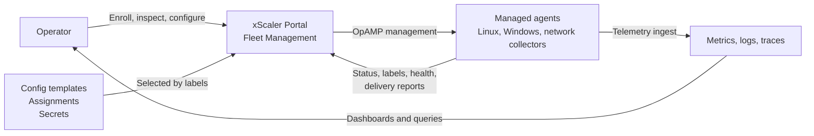

# The xScaler OpenTelemetry agent

The xScaler agent is an unmodified OpenTelemetry Collector. What xScaler adds is
management. You write one block of YAML on the host, and every pipeline after
that arrives from the portal over
[OpAMP](https://opentelemetry.io/docs/collector/management/).

This is the recommended way to get data into xScaler, and the one the rest of
these docs assume. Prometheus `remote_write`, Grafana Alloy and the OTel SDKs
write to the same endpoints and keep working. They just leave you editing config
on every host.

The portal calls this section **Fleet Management**. It handles enrollment,
status, labels, configuration delivery and rollout visibility. Telemetry itself
still flows through the normal metrics, logs and traces ingest endpoints, so
changing fleet configuration does not change how you query your data.

## Start here

1. [Enroll agents](/fleet-management/enroll-agents). One extension block, one
   token, and the host appears in the portal.
2. [Configure agents](/fleet-management/configure-agents). Write a template
   once, assign it by label.
3. [Use config secrets](/fleet-management/secrets) for tokens and community
   strings, so no credential sits in a template.

## How it fits together

Fleet Management controls agent enrollment and configuration. Telemetry ingest remains separate, so changing fleet configuration does not change how you query metrics, logs, or traces in xScaler.

---

## What you can do

Use Fleet Management to:

- View all enrolled agents in one fleet inventory.
- See total, online, offline, and disabled agents.
- Filter agents by name, host, type, or label.
- Inspect hostname, OS, agent type, version, labels, last seen time, and health.
- Create enrollment tokens for new agents.
- Assign default labels during enrollment.
- Create OpenTelemetry Collector config templates.
- Assign config templates to agents by label selectors.
- Store write-only config secrets and reference them from templates.
- Review effective config and delivery history for each agent.
- Disable or delete agents when they should no longer be managed.

---

## Supported targets

Fleet Management targets OpenTelemetry Collector deployments:

- Linux hosts
- Windows hosts
- Network collector hosts
- Other collector deployments that can connect to xScaler over OpAMP

---

## Portal navigation

Open the xScaler portal and go to **Fleet Management**.

| Tab | What you do there |
|-----|-------------------|
| **Agents** | View fleet inventory, status, labels, health, effective config, and delivery history. |
| **Enrollment** | Create enrollment tokens and copy the OpAMP bootstrap snippet. |
| **Config** | Manage config templates, assignments, revisions, rollbacks, and secrets. |

---

## Key concepts

**Agent** - A managed OpenTelemetry Collector or collector supervisor connected to xScaler.

**Enrollment token** - A one-time bootstrap token used to enroll agents into your organisation. The token is shown once when created.

**Per-agent credential** - After enrollment, xScaler gives each agent its own credential for reconnects. You do not need to manage this credential manually.

**Labels** - Key-value attributes reported by the agent or stamped onto agents during enrollment. Use labels to filter inventory and to target config assignments.

**Config template** - A named OpenTelemetry Collector YAML fragment managed in the portal.

**Assignment** - A rule that delivers a config template to agents whose labels match a selector.

**Config secret** - A write-only value, such as an ingest token or SNMP community string, that can be referenced from config templates.

**Effective config** - The rendered config body reported by an agent after config delivery, when supported by the agent.

**Delivery history** - The recent rollout status for a config offered to an agent, including applied and failed states.

---

## What to do next

1. [Enroll agents](/fleet-management/enroll-agents) to bring hosts into Fleet Management.
2. [Configure agents](/fleet-management/configure-agents) with templates and label-based assignments.
3. [Use config secrets](/fleet-management/secrets) for tokens and sensitive values.
