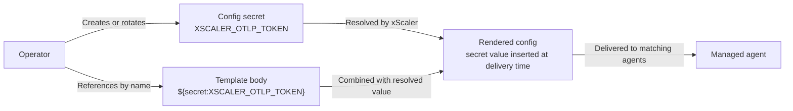

# Config Secrets

Config secrets let you reference sensitive values from Fleet Management config templates without storing plaintext values in the template body.

---

## Secret reference flow



Secret values are write-only in the portal. Templates reference secrets by name, and xScaler resolves the value when config is delivered to matching agents.

---

## When to use secrets

Use config secrets for values such as:

- xScaler ingest tokens
- SNMP community strings
- API keys
- Passwords
- Private endpoints that should not be visible in templates

Do not paste plaintext secrets directly into config templates.

---

## Create a secret

1. Go to **Fleet Management -> Config**.
2. Open the **Secrets** tab.
3. Click **New secret**.
4. Enter a name, description, and value.
5. Click **Create**.

The value is write-only. You can rotate or delete a secret later, but the plaintext value is not shown again.

Secret names can be referenced from templates as:

```text
${secret:NAME}
```

---

## Reference a secret in a template

Use the secret reference where the sensitive value should be rendered.

Example:

```yaml
exporters:
  otlphttp/xscaler:
    endpoint: https://euw1-01.m.xscalerlabs.com
    headers:
      Authorization: "Bearer ${secret:XSCALER_OTLP_TOKEN}"
      X-Scope-OrgID: "<tenant-id>"
```

Common examples:

| Secret reference | Use |
|------------------|-----|
| `${secret:XSCALER_OTLP_TOKEN}` | xScaler OTLP ingest token. |
| `${secret:SNMP_COMMUNITY}` | SNMP community string for network collectors. |
| `${secret:API_KEY}` | Third-party API key used by a receiver or exporter. |

---

## Rotate a secret

1. Go to **Fleet Management -> Config -> Secrets**.
2. Find the secret.
3. Click **Rotate**.
4. Enter the new value.
5. Save the change.

Matching configs receive the new resolved value on the next config delivery cycle.

---

## Delete a secret

Only delete a secret after removing or updating templates that reference it.

If a template still references a deleted secret, matching agents can fail config delivery until the reference is fixed.

---

## What not to store as a secret

These values usually do not need config secrets:

- `X-Scope-OrgID`, because it is a tenant scope identifier, not a secret.
- Environment names.
- Region names.
- Team names.
- Host profile labels.
- Assignment selectors.

Store sensitive credentials as secrets. Store routing and targeting metadata as labels or regular config values.
