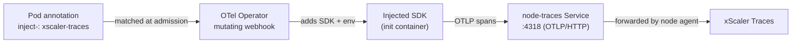

# Trace Auto-Instrumentation (OpenTelemetry Operator)

The OpenTelemetry Operator injects a language SDK into your pods at admission time, producing rich, language-level **distributed traces** with **no code changes and no image rebuild**. Instrumentation is added through an init container when the pod starts.

This is an **opt-in** layer of the xscaler-agent Helm chart. The base agent (metrics and logs) is covered in [Enroll Agents](/fleet-management/enroll-agents) and [Configure Agents](/fleet-management/configure-agents). This page assumes the base agent is already installed and enrolled.

Auto-instrumentation is an alternative — or complement — to [eBPF (OBI)](/fleet-management/ebpf-instrumentation). Use OBI for broad, language-agnostic RED metrics and basic spans; use the Operator when you want deep, SDK-level spans for specific applications.

:::note Versions may drift
The Operator chart and the injected SDK images move independently of the xscaler-agent chart. Pin `<otel-operator-version>` to a known-good release and re-check the upstream [OpenTelemetry Operator](https://github.com/open-telemetry/opentelemetry-operator) docs before upgrading, as CR fields and defaults can change between versions.
:::

---

## eBPF vs. Operator auto-instrumentation

| | **Operator auto-instrumentation** — this page | **eBPF (OBI)** — [see eBPF page](/fleet-management/ebpf-instrumentation) |
|---|---|---|
| How it works | Language SDK injected into the pod at admission | Kernel eBPF probes on network sockets |
| Signal | Rich language-level distributed traces | RED metrics + server/client spans |
| App changes | Pod annotation only | None |
| Restart required | Yes (pod recreated with an init container) | No |
| Language support | java, python, nodejs, dotnet, go | Language-agnostic |
| Privileges | Standard workload permissions | Node DaemonSet needs host access + root |
| Best for | Deep spans for specific applications | Broad, low-effort coverage across services |

---

## How it fits together



Spans from the injected SDK are sent to the **node-local OTLP intake** exposed by the agent chart, which forwards them to xScaler. Sending to the node-local Service keeps trace traffic on-node and reuses the agent's authenticated export path.

---

## Prerequisites

Expose the node-local OTLP intake Service by enabling traces intake on the chart (add to the base install or `helm upgrade --reuse-values`):

```bash
helm upgrade <cluster> oci://ghcr.io/xscaler/charts/xscaler-agent \
  --version <chart-version> \
  --namespace xscaler --reuse-values \
  --set nodeAgent.traces.enabled=true
```

This creates a Service reachable **in-cluster** at:

```
<release>-<chart>-node-traces.<namespace>.svc
```

on port **4318** (OTLP/HTTP). For a release named `<cluster>` installed into the `xscaler` namespace, that resolves to:

```
<cluster>-xscaler-agent-node-traces.xscaler.svc:4318
```

Confirm the Service exists:

```bash
kubectl -n xscaler get svc -l app.kubernetes.io/component=node-traces
```

---

## Step 1 — Install the OpenTelemetry Operator

Install the Operator with Helm from the upstream chart.

```bash
helm repo add open-telemetry https://open-telemetry.github.io/opentelemetry-helm-charts
helm repo update
```

**For development** — let the Operator generate a self-signed webhook certificate:

```bash
helm install opentelemetry-operator open-telemetry/opentelemetry-operator \
  --version <otel-operator-version> \
  --namespace opentelemetry-operator-system --create-namespace \
  --set admissionWebhooks.certManager.enabled=false \
  --set admissionWebhooks.autoGenerateCert.enabled=true
```

:::warning Use cert-manager in production
The self-signed webhook certificate above is for development only. For production, install [cert-manager](/integrations/cert-manager) and let the Operator use it for its mutating webhook (`admissionWebhooks.certManager.enabled=true`). A managed cert avoids webhook downtime when the self-signed cert expires.
:::

Verify the Operator is running:

```bash
kubectl -n opentelemetry-operator-system get pods
```

---

## Step 2 — Apply an `Instrumentation` CR

Create an `Instrumentation` custom resource named `xscaler-traces` **in each application namespace** you want to instrument. It tells the injected SDK where to export and how to propagate context.

```yaml
apiVersion: opentelemetry.io/v1alpha1
kind: Instrumentation
metadata:
  name: xscaler-traces
  namespace: <app-namespace>
spec:
  exporter:
    # Node-local OTLP/HTTP intake from the agent chart.
    endpoint: http://<cluster>-xscaler-agent-node-traces.xscaler.svc:4318
  propagators:
    - tracecontext
    - baggage
  sampler:
    type: parentbased_always_on
```

Apply it:

```bash
kubectl apply -f xscaler-traces-instrumentation.yaml
```

:::note One CR per namespace
The annotation in Step 3 references an `Instrumentation` CR by name, resolved within the pod's own namespace. Create an `xscaler-traces` CR in **every** namespace whose workloads you annotate.
:::

---

## Step 3 — Annotate your workloads

Add an injection annotation to each workload's **pod template** (`spec.template.metadata.annotations`), not the Deployment's top-level metadata. Choose the annotation matching the application's language:

```yaml
spec:
  template:
    metadata:
      annotations:
        instrumentation.opentelemetry.io/inject-<language>: "xscaler-traces"
```

Supported languages and their annotations:

| Language | Annotation |
|----------|------------|
| Java | `instrumentation.opentelemetry.io/inject-java: "xscaler-traces"` |
| Python | `instrumentation.opentelemetry.io/inject-python: "xscaler-traces"` |
| Node.js | `instrumentation.opentelemetry.io/inject-nodejs: "xscaler-traces"` |
| .NET | `instrumentation.opentelemetry.io/inject-dotnet: "xscaler-traces"` |
| Go | `instrumentation.opentelemetry.io/inject-go: "xscaler-traces"` |

The value `"xscaler-traces"` refers to the `Instrumentation` CR from Step 2. When the pod is recreated, the Operator adds an init container that installs the SDK and sets the environment for you — **no image change**.

```bash
# Roll the workload so the webhook injects instrumentation
kubectl -n <app-namespace> rollout restart deployment/<workload>
```

:::warning Injection happens on pod creation
Existing pods are not instrumented in place. The mutating webhook runs only when a pod is **created**, so a rollout (or scale-up) is required for annotated workloads to pick up the SDK.
:::

---

## Step 4 — Verify

1. Confirm the init container was injected:

   ```bash
   kubectl -n <app-namespace> get pod <pod> \
     -o jsonpath='{.spec.initContainers[*].name}{"\n"}'
   # expect an opentelemetry-auto-instrumentation-<language> init container
   ```

2. Generate traffic to the workload.
3. Open the [Traces](/trace-query/overview) view in xScaler and search by `service.name`. You should see spans with language-level detail (framework, DB, and client calls).

---

## Troubleshooting

### No init container appears on new pods

- The annotation is on the wrong object. It must be on the **pod template** (`spec.template.metadata.annotations`), not the Deployment metadata.
- The Operator webhook is not healthy. Check its pods and, in production, that its cert-manager certificate is valid — an expired or missing webhook cert silently skips injection.
- Language mismatch. Confirm the `inject-<language>` matches the actual runtime.

### Init container is injected but no traces arrive

- The `Instrumentation` CR is missing in the workload's namespace, or its name does not match the annotation value (`xscaler-traces`).
- The exporter endpoint is wrong. Confirm `nodeAgent.traces.enabled=true` and that `<cluster>-xscaler-agent-node-traces.<namespace>.svc:4318` resolves from the app namespace.
- The node-traces Service is not present — see [Prerequisites](#prerequisites).

### Traces from some workloads only

Each namespace needs its own `xscaler-traces` `Instrumentation` CR, and each workload needs its own annotation and a rollout. Confirm both for the missing services.
