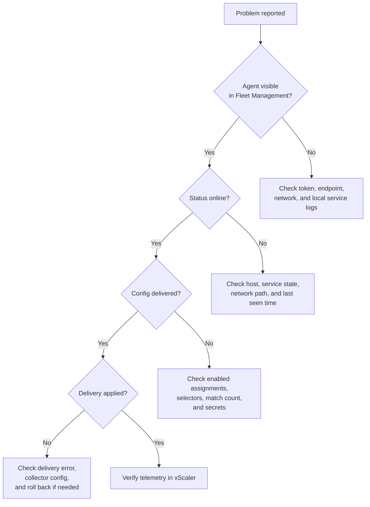

# Troubleshooting Fleet Management

Use this page when agents do not enroll, status looks wrong, or config is not delivered as expected.

---

## Troubleshooting path

Start with visibility and connectivity, then move to config matching and delivery status.

---

## Agent does not appear

Check:

1. The enrollment token was copied from **Fleet Management -> Enrollment**.
2. The token has not expired or reached its max use count.
3. The OpAMP endpoint is `wss://agents.xscalerlabs.com/v1/opamp`.
4. The agent host allows outbound WebSocket Secure traffic to the endpoint.
5. The local supervisor or collector service is running.
6. The local service logs do not show authentication, DNS, TLS, or proxy errors.

Create a new enrollment token if you cannot confirm the original token value.

---

## Agent is offline

An agent is offline when xScaler has not seen an active connection from that agent.

Check:

- The host is running.
- The supervisor or collector service is running.
- The host can reach `wss://agents.xscalerlabs.com/v1/opamp`.
- The agent has not been disabled in the portal.
- The **Last seen** time on the agent detail page.

If the service recently restarted, allow the agent time to reconnect.

---

## Agent is online but has no config

An online agent can be enrolled successfully without receiving config.

Check:

1. At least one assignment is enabled.
2. The assignment selector matches the agent labels.
3. The assignment match count includes the expected agents.
4. The selected template exists.
5. The template YAML is valid.
6. Any referenced config secrets exist.

For first rollout, start with a narrow selector such as `environment=staging` or a single profile label.

---

## Config delivery failed

Open the agent detail page and review **Config delivery history**.

Common causes:

| Cause | What to check |
|-------|---------------|
| Missing secret | Every `${secret:NAME}` reference exists in **Config -> Secrets**. |
| Invalid collector config | The YAML is valid and supported by the target collector. |
| Wrong labels | The assignment targets the intended agent profile. |
| Too broad rollout | The selector matched agents that need a different config. |

If needed, roll back the template to a known-good revision.

---

## Effective config is empty

Some agents can apply config without reporting the full effective config body.

Use these fields to confirm rollout state:

- **Config hash**
- **Config delivery history**
- **Last seen**
- Agent service logs on the host

If the delivery status is `applied`, the agent reported that it accepted the config even if the effective config body is empty.

---

## Delivery is stuck at offered or applying

Check:

1. The agent is still online.
2. The local collector process can restart or reload.
3. The config does not reference unavailable files, ports, or credentials.
4. Host resource limits are not preventing the collector from starting.
5. Local service logs for the agent contain no config parse errors.

If the agent remains stuck, disable the assignment or roll back the template, then investigate locally.

---

## Safe rollout checklist

Use this checklist for production config changes:

1. Create or update the template.
2. Save a clear change note.
3. Assign it to a small label set first.
4. Confirm match count before saving.
5. Watch delivery history for `applied` or `failed`.
6. Verify telemetry arrives in xScaler.
7. Expand the selector gradually.
