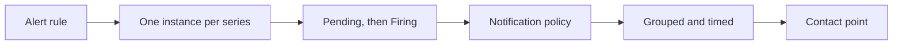

# How alerting works

Five things happen between a query and a message in a Slack channel. Knowing
which one you are looking at makes most alerting problems obvious.



## 1. The rule runs

A rule is a query, a way of turning its result into one number, and a
comparison against a threshold. xScaler runs it on its evaluation interval,
every minute by default, over the last ten minutes of data.

A saved rule is a running rule. There is no cron expression and no start
button, and it keeps evaluating until you pause it.

## 2. Each series becomes an instance

A query that returns one series produces one alert. A query that returns forty
produces forty, one per label set. These are the rule's **instances**, and each
one has its own state.

This is what makes a single rule useful across a fleet:

```promql
100 - (avg by (instance) (rate(node_cpu_seconds_total{mode="idle"}[5m])) * 100)
```

One rule, one alert per host, and the host name is on the alert because it is
on the series.

A query with no `by` clause collapses everything into one series, so you get one
alert that tells you something is wrong somewhere. Group by the label you would
want to read in the notification.

## 3. Pending, then Firing

An instance whose condition just became true starts at **Pending**. It becomes
**Firing** once the condition has held for the rule's pending period. The
default pending period is five minutes.

| State | Meaning | Notifies |
|-------|---------|----------|
| Normal | The condition is false | No |
| Pending | The condition is true, but not for long enough yet | No |
| Firing | The condition has held for the pending period | Yes |
| Paused | Somebody paused the rule | No |

The rule's own state is a summary of its instances. A rule shows Firing as soon
as any one instance is firing, and Pending while all of them are still waiting.

### When the query returns nothing

The rule goes to **No data** and notifies nobody. A metric that stopped being
written looks the same as a metric that is fine, so a rule cannot tell you
about a host that went away. Alert on the absence directly instead:

```promql
absent(up{job="checkout"})
```

### When the query fails

The rule goes to **Error** and notifies nobody. Anything it was already firing
stays firing rather than resolving, so a broken query does not send a false
all-clear in the middle of an incident.

## 4. Routing decides who hears about it

A firing alert carries labels. The notification policy tree reads those labels
and picks a contact point.

Before routing, two things can remove an alert from the queue:

- An **inhibition rule** hides it because a related, more serious alert is
  firing.
- A **silence** hides it because somebody asked for quiet.

See [Silences, mute timings and inhibition rules](/insights/alerting/suppress).

### The labels on an alert

Every alert gets these, whatever your query returned:

| Label | Value |
|-------|-------|
| `alertname` | The rule's name |
| `grafana_folder` | The folder the rule lives in |

The labels from the query result are added next, then the labels you set on the
rule. Rule labels are applied last, so a `severity` you set on the rule wins
over a `severity` that came out of the query.

Route on labels you set on the rule, such as `team` or `severity`, rather than
on the rule name. A new rule with `team=payments` is then routed correctly the
day it is written.

## 5. Grouping and timing

Alerts are gathered into groups before they are sent, and each group has three
timers.

| Timer | Default | What it does |
|-------|---------|--------------|
| Group wait | 30s | Wait this long before the first message about a new group, so alerts arriving together arrive in one message |
| Group interval | 5m | Wait this long before sending an update when the group changes |
| Repeat interval | 4h | Re-send a message about a group that is still firing |

Grouping is by label. The default is `alertname`, so one rule firing on forty
hosts is one message listing forty hosts.

See [Notification policies](/insights/alerting/notification-policies).

## Resolved notifications

When an instance stops firing, xScaler sends a resolved notification through
the same contact point. Contact points can be configured to skip them.

## What is kept

Alert state changes and notification delivery records are kept for 30 days.

## Next

- [Alert rules](/insights/alerting/alert-rules) to write one.
- [Notifications are not arriving](/insights/alerting/troubleshooting) when a
  rule fires and nobody hears.
