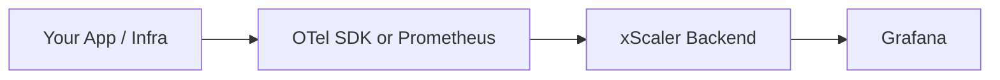

# xScaler Managed Metrics Backend

**xScaler Managed Metrics Backend** is a fully managed, Prometheus-compatible metrics backend built for teams that need reliable, scalable observability without the overhead of running infrastructure themselves.

## What it is

xScaler acts as a drop-in remote storage target for any Prometheus-compatible stack. You push metrics from your existing Prometheus, Grafana Alloy, OpenTelemetry Collector, or OTel SDK — xScaler handles ingestion, storage, and querying at scale.

- **Prometheus-compatible** — works with any tool that speaks Prometheus `remote_write` or PromQL.
- **Multi-tenant** — each tenant's data is fully isolated via the `X-Scope-OrgID` header.
- **Fully managed** — no servers, no WAL, no compaction jobs to maintain.

## Architecture



Your instrumented application or infrastructure emits metrics through an OTel SDK, Prometheus, or Grafana Alloy. Those metrics flow into the xScaler backend over `remote_write` or OTLP. Grafana (or any PromQL-capable tool) queries the data back out.

## Supported ingest methods

| Method | Protocol | Endpoint |
|--------|----------|----------|
| Prometheus `remote_write` | HTTP | `POST /api/v1/push` |
| OpenTelemetry Collector | OTLP/HTTP | `POST /otlp/v1/metrics` |
| OpenTelemetry Collector | OTLP/gRPC | `:443` (TLS) |
| Grafana Alloy | HTTP (remote_write) | `POST /api/v1/push` |
| OTel SDK (Python / Node.js / Go) | OTLP/HTTP | `POST /otlp/v1/metrics` |

## Supported query methods

xScaler exposes the **full Prometheus HTTP API** at `/prometheus/api/v1/...`, so any tool that supports PromQL works — Grafana, Prometheus-compatible dashboards, custom scripts using `curl`, and more.

## Multi-tenancy

Every request to xScaler — both writes and reads — must include two HTTP headers:

```
Authorization: Bearer <token>
X-Scope-OrgID: <tenant-id>
```

The `X-Scope-OrgID` header is the **tenant isolation header**. Without it, xScaler cannot identify which tenant namespace to write into or query from, and the request will be rejected with a `400` or `401` error.

:::info
These two headers are **mandatory on every single request**. See [Authentication](/authentication) for full details.
:::

## Next steps

- [Quick Start](/getting-started) — connect your first metrics source in minutes
- [Authentication](/authentication) — tokens, scopes, and header requirements
- [Regions & Endpoints](/regions) — choose the right region for your workload
