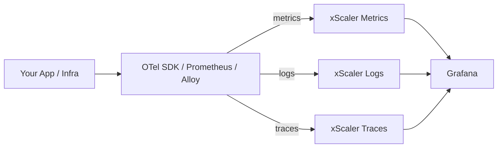

# xScaler Managed Observability Backend

**xScaler Managed Observability Backend** is a fully managed, multi-signal observability platform built for teams that need reliable, scalable metrics, logs, and traces without the overhead of running infrastructure themselves.

## What it is

xScaler acts as a drop-in backend for any OpenTelemetry-compatible stack. You push telemetry from your existing Prometheus, Grafana Alloy, OpenTelemetry Collector, or OTel SDKs — xScaler handles ingestion, storage, and querying at scale across all three signals.

- **Multi-signal** — metrics, logs, and traces in a single platform.
- **OpenTelemetry-native** — OTLP over HTTP and gRPC for all signals; Prometheus `remote_write` also supported for metrics.
- **Multi-tenant** — each tenant's data is fully isolated via the `X-Scope-OrgID` header.
- **Fully managed** — no servers, no storage tuning, no compaction jobs to maintain.

## Architecture


```mermaid
graph LR
    A["Your App / Infra"] --> B["OTel SDK / Prometheus / Alloy"]
    B -->|metrics| C["xScaler Metrics"]
    B -->|logs| D["xScaler Logs"]
    B -->|traces| E["xScaler Traces"]
    C & D & E --> F["Grafana"]
```

Your instrumented application or infrastructure emits telemetry through an OTel SDK, Prometheus, or Grafana Alloy. That telemetry flows into xScaler over `remote_write` or OTLP. Grafana (or any compatible tool) queries the data back out.

## Supported ingest methods

### Metrics

| Method | Protocol | Endpoint |
|--------|----------|----------|
| Prometheus `remote_write` | HTTP | `POST /api/v1/push` |
| OpenTelemetry Collector | OTLP/HTTP | `POST /otlp/v1/metrics` |
| OpenTelemetry Collector | OTLP/gRPC | `:443` (TLS) |
| Grafana Alloy | HTTP (`remote_write`) | `POST /api/v1/push` |
| OTel SDK (Python / Node.js / Go) | OTLP/HTTP | `POST /otlp/v1/metrics` |

### Logs

| Method | Protocol | Endpoint |
|--------|----------|----------|
| Grafana Alloy | HTTP (push) | `POST /api/v1/push` |
| OpenTelemetry Collector | OTLP/HTTP | `POST /otlp/v1/logs` |
| OpenTelemetry Collector | OTLP/gRPC | `:443` (TLS) |
| OTel SDK (Python / Node.js / Go) | OTLP/HTTP | `POST /otlp/v1/logs` |

### Traces

| Method | Protocol | Endpoint |
|--------|----------|----------|
| OpenTelemetry Collector | OTLP/HTTP | `POST /otlp/v1/traces` |
| OpenTelemetry Collector | OTLP/gRPC | `:443` (TLS) |
| Grafana Alloy | OTLP/HTTP | `POST /otlp/v1/traces` |
| OTel SDK (Python / Node.js / Go) | OTLP/HTTP | `POST /otlp/v1/traces` |

## Supported query methods

| Signal | Query language | Base URL |
|--------|---------------|----------|
| Metrics | PromQL | `https://<region>.m.xscalerlabs.com` |
| Logs | LogQL | `https://<region>.l.xscalerlabs.com` |
| Traces | TraceQL | `https://<region>.t.xscalerlabs.com` |

## Multi-tenancy

Every request to xScaler — both writes and reads, for all signals — must include two HTTP headers:

```
Authorization: Bearer <token>
X-Scope-OrgID: <tenant-id>
```

The `X-Scope-OrgID` header is the **tenant isolation header**. Without it, xScaler cannot identify which tenant namespace to write into or query from, and the request will be rejected with a `400` or `401` error.

:::info
These two headers are **mandatory on every single request**. See [Authentication](/authentication) for full details.
:::

## Next steps

- [Quick Start](/getting-started) — connect your first telemetry source in minutes
- [Authentication](/authentication) — tokens, scopes, and header requirements
- [Regions & Endpoints](/regions) — choose the right region for your workload
